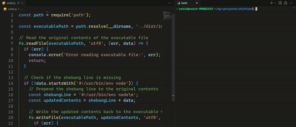

# 💩 Shittier

**Shittier** is a code formatting tool that aims to make your code look as terrible as possible. It is the exact opposite of popular tools like Prettier, which focus on improving code formatting and readability. Shittier embraces chaos, messiness, and confusion, making your code look shittier than ever before.

With Shittier, you can expect the following:

- Random indentation for a chaotic code structure.
- Mixed case madness that breaks consistency.
- Spacing nightmares with added or removed spaces, tabs, and line breaks.
<!-- - Creative comment chaos with sarcastic or nonsensical remarks. -->



## 📥️ Installation

To install Shittier, follow these steps:

1. Make sure you have **Node.js** installed on your machine.
2. Open a terminal and run the following command:
   ```
   npm install -g shittier
   ```

## 🚀 Usage

After installing Shittier, you can run it on your codebase by executing the following command in your project's root directory:

```
shittier [options] [directory/file]
```

### Options

- `-h, --help`: Displays help information about Shittier and its available options.
- `-v, --version`: Shows the installed version of Shittier.
- `-f, --force`: Forces Shittier to overwrite files if they already exists.

### Examples

- Format a single file:
  ```
  shittier myfile.js
  ```

- Format a single file and save the modified file with a different name or path:
  ```
  shittier myfile.js modified/myfile.js
  ```
  Use `--force` flag to force overwrite if output file already exists

## ⚠️ Disclaimer

Shittier is a purely satirical project created for fun and entertainment purposes. It is not intended for use in any serious development environment. Using Shittier on production code may result in confusion, frustration, and a lot of head-scratching. Use it responsibly and at your own risk.

## 📜 License

Shittier is released under the [MIT License](https://opensource.org/licenses/MIT). See the [LICENSE](LICENSE) file for more details.

---

Enjoy the chaos and let Shittier transform your perfectly fine code into an unrecognizable mess! Remember, sometimes it's good to embrace the dark side of code formatting. Happy shittifying!
